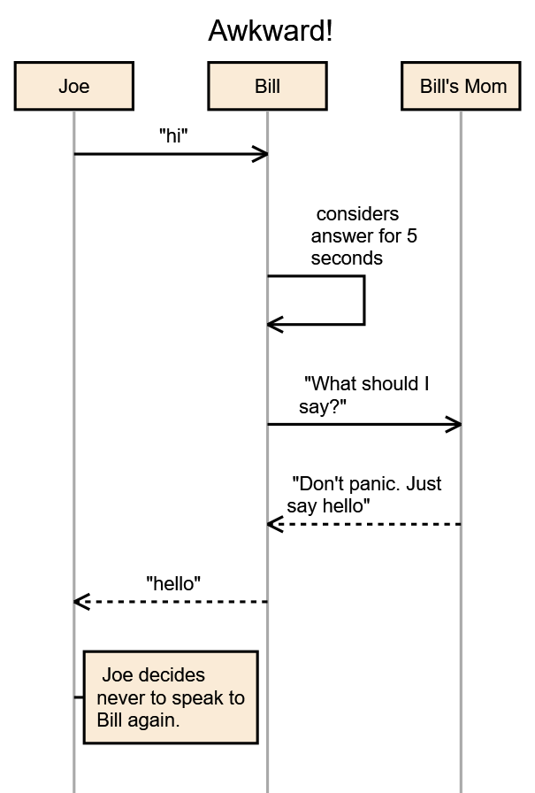

Sequence Diagram Tool in C#/WPF
===============================

I was inspired by web-based tools like [this one][1], but
the environment were I work forces us to use pre-SVG browsers.
So, I whipped up a WPF app.

Basically, you type in the panel on the left, and every time you
stop typing, it renders an updated diagram.  You can then 
save your completed diagram as a PNG. 


Grammar
-------

The grammar is very simple (it's a regular language, line-by-line).


  * `Title : string` Defines a title for the diagram.
  * `ID [ : string ]`  Declares an actor, and optionally refines a display-name for it.
  * `ID to ( ID|self ) [ dashed ] [ : string ]` Defines an arrow line from the first ID to 
the seond ID (or to itself if the second actor is `self`).  If the `dashed` token is provided, 
the line will be dashed.  If given, a title string is added to the line.
  * `Note ID : string` Adds a note to the actor with the given string.

That, along with a comment token, `#`, is the entire grammar.  The actors in the diagram
do not have to be pre-declared; if you mention a new name you get a new actor.  That said, the easiest
way to force the ordering from left to right is to declare the actors in the order you want.


Example
--------

Here's an example that covers most of the features, and shows that you can provide
information like the title and display names just about anywhere... even at the end. 


```
Joe to Bill : "hi"
Bill to self: considers answer for 5 seconds
Bill to bm: "What should I say?"
bm to Bill dashed: "Don't panic. Just say hello"
Bill to Joe dashed: "hello"
note Joe: Joe decides never to speak to Bill again.

bm: Bill's Mom
Title: Awkward!
``` 

...gets you:




[1]: https://github.com/bramp/js-sequence-diagrams

